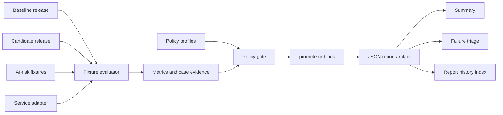

# EvalGate AI Overview

## What It Is

EvalGate AI is a release-control service for model-backed systems. It compares a trusted baseline release against a candidate release, evaluates the result against explicit policy thresholds, and returns a final decision of `promote` or `block`.

The point of the project is not model quality research. The point is operational release discipline for AI systems.

## Why It Exists

Traditional health checks are not enough for model-backed services. A release can look healthy while still being worse in ways that matter:

- slower responses
- higher error rates
- lower answer quality
- higher cost per request

EvalGate AI turns those concerns into an explicit gate that can be used locally or in CI.

## Release Workflow

1. A baseline release and candidate release are registered.
2. Both are evaluated against the same deterministic fixture set.
3. The evaluator calls an inference service adapter for each fixture case.
4. Metrics are aggregated and compared.
5. Policy checks are applied.
6. A decision report is generated and persisted.
7. CI, release automation, or an operator acts on the result.

## Architecture

EvalGate is split into small operational pieces:

- **API boundary**: `POST /releases/evaluate` accepts a baseline, candidate, and policy.
- **CLI boundary**: `evalgate` runs release gates, report validation, summaries, triage, history lookup, and the built-in demo.
- **Fixture evaluator**: runs the same deterministic scenarios against each release.
- **Service adapter**: isolates release execution from the evaluator; the repo ships a deterministic registry-backed adapter for local and CI use.
- **Policy engine**: compares baseline and candidate metrics against named policy profiles.
- **Report store**: persists JSON reports and a local index for report lookup and history filtering.
- **CI workflows**: validate config, run a known-good release gate, validate reports, publish job summaries, comment on pull requests, and upload report artifacts.

## Operator Surfaces

EvalGate is designed to leave release evidence behind instead of only returning a pass/fail status.

- `evalgate --demo` runs the full passing and blocking workflow.
- `evalgate --baseline baseline --candidate candidate-good --policy default` evaluates a candidate.
- `evalgate --summarize-report reports/<report_id>.json` emits compact JSON or Markdown for integration surfaces.
- `evalgate --triage-report <report_id>` focuses on failed checks, failed cases, severity, and risk category.
- `evalgate --list-reports --report-candidate candidate-bad --report-decision block` reviews indexed release history.
- `evalgate --show-report <report_id>` prints the full saved report artifact.

## Report Contract

Every evaluation persists `reports/<report_id>.json`. The report includes:

- run metadata and EvalGate version
- active policy and threshold snapshot
- all policy checks and failed checks
- aggregate baseline, candidate, and delta metrics
- per-case evidence for the fixture set
- operator-friendly evidence summary

The report contract is documented in [report-contract.md](report-contract.md), and the CLI can print the JSON Schema with `evalgate --print-report-schema`.

## What This Repo Optimizes For

- clear release logic with explicit policy thresholds
- deterministic local and CI behavior
- cross-platform execution on Windows, macOS, and Linux
- auditable release decisions with durable report artifacts
- operator workflows that support review after the gate has run
